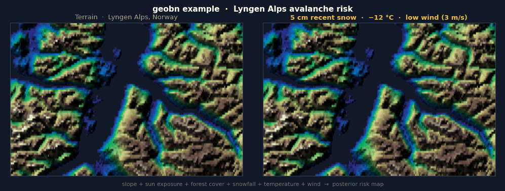

# geobn

[](https://github.com/jensebr/geobn/actions/workflows/tests.yml)
[](https://www.python.org/downloads/)
[](LICENSE)

Bayesian network inference over geospatial data.



> **Under development** — the API is functional and tested, but may change before a stable 1.0 release.

`geobn` lets you turn heterogeneous data sources (offline and real-time) into insight over geographical areas by using techniques in probabilistic AI. The library is domain-agnostic, and may be used for, e.g., environmental risk assessment and risk‑informed route planning.

This is achieved by wiring different data sources — rasters, remote APIs, or plain scalars — directly into a Bayesian network, and run pixel-wise inference, producing posterior probability maps and entropy rasters. Under the hood it uses disk caching of remote data and groups pixels by unique evidence combinations, so each inference query is solved once per combination instead of once per pixel, keeping computations of large areas computationally tractable.

Full docs (API reference, concepts, examples) are hosted at:
**https://jensebr.github.io/geobn**

---

## Install

> **PyPI release coming soon.** Until then, install directly from source (Python ≥ 3.13 required):

```bash
uv pip install git+https://github.com/jensebr/geobn.git
```

To also run the bundled examples, clone the repo instead:

```bash
git clone https://github.com/jensebr/geobn.git
cd geobn
uv pip install -e ".[dev]"
```

---

## Data sources

| Class | Use case |
|---|---|
| `ArraySource(array, crs, transform)` | In-memory numpy array |
| `ConstantSource(value)` | Broadcast a scalar over the entire grid |
| `RasterSource(path)` | Local GeoTIFF / any rasterio-readable file |
| `URLSource(url, timeout, cache_dir)` | Remote Cloud-Optimised GeoTIFF |
| `WCSSource(url, layer, valid_range=...)` | Generic OGC WCS endpoint (terrain, bathymetry, …) |
| `PointGridSource(fn, sample_points, delay)` | Sample any `fn(lat, lon) -> float` over the bounding box with user-defined resolution |

---

## How it works

```
DataSources  →  align to grid  →  discretize  →  BN inference  →  InferenceResult
```

1. **Load a BN** — `geobn.load("model.bif")` reads a standard `.bif` file via pgmpy.
2. **Attach sources** — each evidence node gets a `DataSource`. All sources are reprojected and resampled to a common grid at inference time (the finest-resolution georeferenced source sets the grid automatically, or call `bn.set_grid()` explicitly).
3. **Discretize** — `set_discretization(node, breakpoints)` bins continuous values into the discrete states your BN expects.
4. **Infer** — unique evidence combinations are batched; pgmpy `VariableElimination` runs once per unique combo, not once per pixel.
5. **Export** — `InferenceResult` gives you a numpy array, an xarray Dataset, or a multi-band GeoTIFF (N probability bands + entropy).

---

## Usage

The examples below use the bundled Lyngen Alps avalanche risk model (see [`examples/lyngen_alps/`](examples/lyngen_alps/)) and demonstrate all six source types.

### Loading a network

```python
import geobn

bn = geobn.load("avalanche_risk.bif")
bn.set_grid("EPSG:4326", resolution=0.005, extent=(19.8, 69.35, 21.0, 69.75))
```

### Connecting data sources

Attach a `DataSource` to each evidence node. Sources can be remote services, local files, derived arrays, or plain scalars — they are all reprojected and aligned to a common grid at inference time.

```python
# WCSSource — fetch data (e.g., terrain) from WVS server
dtm = geobn.WCSSource(
    url="https://hoydedata.no/arcgis/services/las_dtm_somlos/ImageServer/WCSServer",
    layer="las_dtm",
    version="1.0.0",
    valid_range=(-500, 9000),  # replaces out-of-range sentinel values with NaN
    cache_dir="cache/",
)

# Also possible to extract data as raw numpy array, and do own processing
dtm_array = bn.fetch_raw(geobn.WCSSource(...))
slope_deg, sun_exposure = my_custom_function(dtm_array)

# ArraySource (with no CRS) - wire pre-aligned numpy arrays directly
bn.set_input("slope_angle",  geobn.ArraySource(slope_deg))
bn.set_input("sun_exposure", geobn.ArraySource(sun_exposure))

# RasterSource — Reads local GeoTIFF from disk
bn.set_input("forest_cover", geobn.RasterSource("forest_cover.tif"))

# URLSource — remote Cloud-Optimised GeoTIFF
bn.set_input("recent_snow", geobn.URLSource("https://example.com/recent_snow.tif"))

# PointGridSource — sample any fn(lat, lon) -> float over the bounding box
# Useful for point weather APIs (MET Norway Frost, Open-Meteo, etc.)
import requests
def fetch_wind_speed(lat, lon):
    r = requests.get(f"https://api.example.com/wind?lat={lat}&lon={lon}")
    return r.json()["wind_speed_ms"]

bn.set_input("wind_load", geobn.PointGridSource(fetch_wind_speed, sample_points=20))

# ConstantSource — broadcast a single scalar over the entire grid
bn.set_input("temperature", geobn.ConstantSource(-5.0))   # °C
```

### Discretizing continuous inputs

Breakpoints map continuous raster values into the discrete states your BN expects. The number of intervals must match the number of states for that node.

```python
bn.set_discretization("slope_angle",  [0, 5, 25, 40, 90])          # degrees
bn.set_discretization("sun_exposure", [-0.5, 0.5, 1.5, 2.5, 3.5])  # N/E/W/S
bn.set_discretization("forest_cover", [-0.5, 0.5, 1.5, 2.5])       # sparse/moderate/dense
bn.set_discretization("wind_load",    [0, 5, 15, 50])              # m/s
bn.set_discretization("recent_snow",  [0, 10, 25, 150])            # cm
bn.set_discretization("temperature",  [-40, -8, -2, 15])           # °C
```

### Running inference

```python
result = bn.infer(query=["avalanche_risk"])
```

`infer()` returns an `InferenceResult` with a posterior probability array and entropy map for each queried node.

```python
probs = result.probabilities["avalanche_risk"]  # (H, W, n_states) — one band per state
ent   = result.entropy("avalanche_risk")         # (H, W) — Shannon entropy in bits

# State names come directly from the .bif file
for i, state in enumerate(result.state_names["avalanche_risk"]):
    print(f"P({state}) mean: {probs[..., i].mean():.3f}")
```

### Exporting results

```python
result.to_xarray()          # xarray Dataset
result.to_geotiff("out/")   # multi-band GeoTIFF: N probability bands + entropy
result.show_map("out/")     # interactive Leaflet map
```

### Caching remote data to disk

`URLSource` and `WCSSource` accept a `cache_dir` argument. When set, fetched data is written to disk as `.npy` files and reused on subsequent runs — **including across Python sessions and script restarts**. No network request is made if a matching cache file already exists.

The cache key is a SHA-256 hash of the URL and request parameters (bounding box, resolution, layer), so changing the grid or source automatically triggers a fresh fetch.

```python
dtm = geobn.WCSSource(
    url="https://hoydedata.no/arcgis/services/las_dtm_somlos/ImageServer/WCSServer",
    layer="las_dtm",
    version="1.0.0",
    valid_range=(-500, 9000),
    cache_dir="cache/",   # survives process restarts
)

snow = geobn.URLSource("https://example.com/recent_snow.tif", cache_dir="cache/")
```

This is particularly useful when iterating on discretization rules or BN structure — fetch the terrain data once, then experiment freely without waiting for remote requests on every run.

### Repeated inference with changing inputs

When static inputs (terrain) are mixed with inputs that change between runs (weather), freeze the static nodes so their arrays are fetched and discretized only once:

```python
# Terrain nodes are frozen: fetched and cached on the first infer() call
bn.freeze("slope_angle", "sun_exposure", "forest_cover")

# Sweep over wind scenarios without re-fetching or re-discretizing terrain
for wind_ms in [3, 8, 20]:
    bn.set_input("wind_load", geobn.ConstantSource(wind_ms))
    result = bn.infer(query=["avalanche_risk"])
    result.to_geotiff(f"out/wind_{wind_ms}ms/")
```

For maximum throughput, pre-run all evidence combinations once and reduce subsequent calls to a numpy index lookup:

```python
bn.precompute(query=["avalanche_risk"])  # one-time cost: runs all state combinations
result = bn.infer(query=["avalanche_risk"])  # O(H×W) array indexing — no pgmpy at runtime
```

---

## Examples

| Example | Description |
|---|---|
| [`examples/lyngen_alps/`](examples/lyngen_alps/) | Avalanche risk: Kartverket DTM via WCSSource + configurable weather, Lyngen Alps, Norway |

Run from the repo root:

```bash
uv run python examples/lyngen_alps/run_example.py
```

---

## Academic foundation

`geobn` is a software realisation of ideas developed during the author's PhD research. If you use this library in academic work, please consider citing the following paper:

> J. E. Bremnes, I. B. Utne, T. R. Krogstad, and A. J. Sørensen,
> "Holistic Risk Modeling and Path Planning for Marine Robotics,"
> *IEEE Journal of Oceanic Engineering*, vol. 50, no. 1, pp. 252–275, 2025.
> DOI: [10.1109/JOE.2024.3432935](https://doi.org/10.1109/JOE.2024.3432935)

---

## Declaration of AI use

This library was written with the assistance of Claude (Anthropic). All concepts, design decisions, and research ideas originate with the author.
