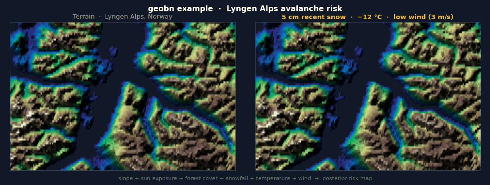

# geobn

[](https://github.com/jensbremnes/geobn/actions/workflows/tests.yml)
[](https://www.python.org/downloads/)
[](LICENSE)
[](CONTRIBUTING.md)

Bayesian network inference over geospatial data.



`geobn` lets you turn heterogeneous data sources (offline and real-time) into insight over geographical areas by using techniques in probabilistic AI. The library is domain-agnostic, and may be used for, e.g., environmental risk assessment and risk‑informed route planning.

This is achieved by wiring different data sources — rasters, remote APIs, or plain scalars — directly into a Bayesian network, and run pixel-wise inference, producing posterior probability maps and entropy rasters. Under the hood it groups pixels by unique evidence combinations and, for large networks, solves *all* combinations with a single joint query — so inference stays fast even with many evidence nodes over millions of pixels. Static sources can be disk-cached to avoid redundant network fetches, and `bn.precompute()` can pre-solve all evidence combinations into a lookup table, reducing repeated inference calls to pure array indexing. The table can be saved with `bn.save_precomputed()` and loaded on any machine with `bn.load_precomputed()` — no pgmpy required at runtime.

Full docs (API reference, concepts, examples) are hosted at:
**https://jensbremnes.github.io/geobn**

---

## Install

```bash
pip install geobn
```

To also run the bundled examples, clone the repo instead:

```bash
git clone https://github.com/jensbremnes/geobn.git
cd geobn
pip install -e ".[dev]"
```

---

## Data sources

| Class | Use case |
|---|---|
| `ArraySource(array, crs, transform)` | In-memory numpy array |
| `ConstantSource(value)` | Broadcast a scalar over the entire grid |
| `RasterSource(path)` | Local GeoTIFF / any rasterio-readable file |
| `URLSource(url, timeout, cache_dir)` | Remote Cloud-Optimised GeoTIFF |
| `WCSSource(url, layer, version)` | Generic OGC WCS endpoint (terrain, bathymetry, …) |
| `PointGridSource(fn, sample_points, delay)` | Sample any `fn(lat, lon) -> float` over the bounding box with user-defined resolution |

`URLSource`, `WCSSource` and `PointGridSource` also take `cache_dir` and `cache_ttl` to cache
fetched data on disk and expire it after a given age.

Every source also takes `valid_range=(lo, hi)`, which replaces values outside the range
with NaN. Use it for data that encodes missing values as an extreme number, such as −9999,
without declaring it as nodata. Either bound may be `None` to leave that side unbounded.

---

## How it works

```
DataSources  →  align to grid  →  discretize  →  BN inference  →  InferenceResult
```

1. **Load a BN** — `geobn.load("model.bif")` dispatches on the file extension and reads `.bif`, `.xmlbif`, `.xml`, `.net` (Hugin), `.xdsl` (GeNIe) and `.uai` via pgmpy. A pgmpy model can also be wrapped directly with `geobn.GeoBayesianNetwork(model)`.
2. **Attach sources** — each evidence node gets a `DataSource`. Any node can be an evidence node, so a dataset that measures an intermediate concept can be used in place of the layers that feed it. All sources are reprojected and resampled to a common grid at inference time (the georeferenced source with the finest resolution, compared in metres, sets the grid automatically, or call `bn.set_grid()` explicitly).
3. **Discretize** — `set_discretization(node, breakpoints)` bins continuous values into the discrete states your BN expects.
4. **Infer** — pixels are grouped by unique evidence combination, never queried individually. The strategy is chosen from the combinations **actually observed on the map** (usually far fewer than the theoretically possible ones): a handful of combinations means a few targeted pgmpy `VariableElimination` queries; many combinations means the full conditional table P(query | evidence) is computed with a *single* joint query and results are mapped to pixels by array indexing. See [How it works](https://jensbremnes.github.io/geobn/concepts/#inference-batching) for details.
5. **Export** — `InferenceResult` gives you a numpy array, an xarray Dataset, or a multi-band GeoTIFF (N probability bands + entropy).

---

## Usage

The examples below use the bundled Lyngen Alps avalanche risk model (see [`examples/lyngen_alps/`](examples/lyngen_alps/)) and demonstrate all six source types.

### Loading a network

```python
import geobn

bn = geobn.load("avalanche_risk.bif")
bn.set_grid("EPSG:4326", resolution=0.005, extent=(19.8, 69.35, 21.0, 69.75))
```

`load()` picks the reader from the extension: `.bif`, `.xmlbif`, `.net` (Hugin),
`.xdsl` (GeNIe) and `.uai`. A bare `.xml` file is resolved from its root element
(`<BIF>`, `<smile>` or `<ANALYSISNOTEBOOK>`). UAI files store no names, so their nodes
arrive as `var_0`, `var_1`, … and their states as integers; loading one warns about it.
Netica `.dne` is not supported — pgmpy has no reader for it, so export to `.net` or
`.bif` from Netica.

Any pgmpy `DiscreteBayesianNetwork` can be used directly, which covers models built in
code, fitted with a pgmpy estimator, or read with a reader `load()` does not dispatch on:

```python
from pgmpy.readwrite import XBNReader

bn = geobn.GeoBayesianNetwork(XBNReader("model.dat").get_model())
```

### Connecting data sources

Attach a `DataSource` to each evidence node. Sources can be remote services, local files, derived arrays, or plain scalars — they are all reprojected and aligned to a common grid at inference time. DataSource objects are **declarative** — constructing one performs no I/O. Data is fetched lazily when you call `bn.infer()` (or `bn.fetch_raw()` for manual extraction).

```python
# WCSSource — fetch data (e.g., terrain) from WVS server
dtm = geobn.WCSSource(
    url="https://hoydedata.no/arcgis/services/las_dtm_somlos/ImageServer/WCSServer",
    layer="las_dtm",
    version="1.0.0",
    valid_range=(-500, 9000),  # replaces out-of-range sentinel values with NaN
    cache_dir="cache/",
)

# Also possible to extract data as raw numpy array, and do own processing
dtm_array = bn.fetch_raw(geobn.WCSSource(...))
slope_deg, sun_exposure = my_custom_function(dtm_array)

# ArraySource (with no CRS) - wire pre-aligned numpy arrays directly
bn.set_input("slope_angle",  geobn.ArraySource(slope_deg))
bn.set_input("sun_exposure", geobn.ArraySource(sun_exposure))

# RasterSource — Reads local GeoTIFF from disk
bn.set_input("forest_cover", geobn.RasterSource("forest_cover.tif"))

# URLSource — remote Cloud-Optimised GeoTIFF
bn.set_input("recent_snow", geobn.URLSource("https://example.com/recent_snow.tif"))

# PointGridSource — sample any fn(lat, lon) -> float over the bounding box
# Useful for point weather APIs (MET Norway Frost, Open-Meteo, etc.)
import requests
def fetch_wind_speed(lat, lon):
    r = requests.get(f"https://api.example.com/wind?lat={lat}&lon={lon}")
    return r.json()["wind_speed_ms"]

bn.set_input("wind_load", geobn.PointGridSource(fetch_wind_speed, sample_points=20))

# ConstantSource — broadcast a single scalar over the entire grid
bn.set_input("temperature", geobn.ConstantSource(-5.0))   # °C
```

### Discretizing continuous inputs

Breakpoints map continuous raster values into the discrete states your BN expects. The number of intervals must match the number of states for that node.

```python
bn.set_discretization("slope_angle",  [0, 5, 25, 40, 90])          # degrees
bn.set_discretization("sun_exposure", [-0.5, 0.5, 1.5, 2.5, 3.5])  # N/E/W/S
bn.set_discretization("forest_cover", [-0.5, 0.5, 1.5, 2.5])       # sparse/moderate/dense
bn.set_discretization("wind_load",    [0, 5, 15, 50])              # m/s
bn.set_discretization("recent_snow",  [0, 10, 25, 150])            # cm
bn.set_discretization("temperature",  [-40, -8, -2, 15])           # °C
```

When the thresholds are not fixed by the model, `suggest_breakpoints()` derives them
from the data the node's source returns — `"quantile"` for bins holding equal numbers of
pixels, `"equal_interval"` for bins of equal width. The bin count comes from the node's
states in the BN.

```python
bn.set_discretization("slope_angle", bn.suggest_breakpoints("slope_angle"))
bn.set_discretization("wind_load",   bn.suggest_breakpoints("wind_load", bounds=(0, 50)))
```

The same schemes are available for any array as `geobn.breakpoints.quantile(arr, n)` and
`geobn.breakpoints.equal_interval(arr, n)`.

### Running inference

```python
result = bn.infer(query=["avalanche_risk"])
```

`infer()` returns an `InferenceResult` with a posterior probability array and entropy map for each queried node.

```python
probs = result.probabilities["avalanche_risk"]  # (H, W, n_states) — one band per state
ent   = result.entropy("avalanche_risk")         # (H, W) — Shannon entropy in bits
p_hi  = result.exceedance("avalanche_risk", "high")  # (H, W) — P(risk >= high)

# State names come directly from the model file
for i, state in enumerate(result.state_names["avalanche_risk"]):
    print(f"P({state}) mean: {probs[..., i].mean():.3f}")
```

### Exporting results

```python
result.to_xarray()          # xarray Dataset
result.to_geotiff("out/")   # multi-band GeoTIFF: N probability bands + entropy
result.show_map("out/")     # interactive Leaflet map
```

### Caching remote data to disk

`URLSource`, `WCSSource` and `PointGridSource` accept a `cache_dir` argument. When set, fetched data is written to disk as `.npy` files and reused on subsequent runs — **including across Python sessions and script restarts**. No network request is made if a matching cache file already exists.

The cache key is a SHA-256 hash of the URL and request parameters (bounding box, resolution, layer), so changing the grid or source automatically triggers a fresh fetch.

```python
dtm = geobn.WCSSource(
    url="https://hoydedata.no/arcgis/services/las_dtm_somlos/ImageServer/WCSServer",
    layer="las_dtm",
    version="1.0.0",
    valid_range=(-500, 9000),
    cache_dir="cache/",   # survives process restarts
)

snow = geobn.URLSource("https://example.com/recent_snow.tif", cache_dir="cache/")
```

This is particularly useful when iterating on discretization rules or BN structure — fetch the terrain data once, then experiment freely without waiting for remote requests on every run.

Add `cache_ttl` for data that changes. An entry older than the TTL is fetched again; without one, a cached entry is used forever, which is what terrain and bathymetry want.

```python
from datetime import timedelta

waves = geobn.PointGridSource(
    fn=sea_state,
    name="wave_height",           # identifies the entry; a callable cannot
    cache_dir="cache/",
    cache_ttl=timedelta(hours=6),
)
```

If the data is stale and the fetch then fails, the expired entry is returned with a `UserWarning` giving its age, so a run offline still produces a map instead of an error.

### Repeated inference with changing inputs

When static inputs (terrain) are mixed with inputs that change between runs (weather), freeze the static nodes so their arrays are fetched and discretized only once:

```python
# Terrain nodes are frozen: fetched and cached on the first infer() call
bn.freeze("slope_angle", "sun_exposure", "forest_cover")

# Sweep over wind scenarios without re-fetching or re-discretizing terrain
for wind_ms in [3, 8, 20]:
    bn.set_input("wind_load", geobn.ConstantSource(wind_ms))
    result = bn.infer(query=["avalanche_risk"])
    result.to_geotiff(f"out/wind_{wind_ms}ms/")
```

For maximum throughput, pre-solve all evidence combinations once and reduce subsequent calls to a numpy index lookup. `bn.precompute()` builds the full conditional table for every combination of discrete evidence states (computed with a single pgmpy joint query, so it is cheap even for large state spaces), and subsequent `bn.infer()` calls resolve each pixel by indexing into that table — no pgmpy inference at runtime.

```python
bn.precompute(query=["avalanche_risk"])  # one-time cost: one joint query covers all state combinations
result = bn.infer(query=["avalanche_risk"])  # O(H×W) array indexing — no pgmpy at runtime
```

To persist the table for offline deployment, save it after `precompute()` and load it on the target machine — no pgmpy inference runs at load or infer time:

```python
# Workstation: build and save
bn.precompute(query=["avalanche_risk"])
bn.save_precomputed("avalanche_table.npz")

# Robot / edge device: load and infer
bn.load_precomputed("avalanche_table.npz")
result = bn.infer(query=["avalanche_risk"])  # pure numpy, no pgmpy
```

---

## Examples

| Example | Description |
|---|---|
| [`examples/lyngen_alps/`](examples/lyngen_alps/) | Avalanche risk: Kartverket DTM via WCSSource + configurable weather, Lyngen Alps, Norway |

Run from the repo root:

```bash
python examples/lyngen_alps/run_example.py
```

---

## Contributing

Contributions are welcome! Whether it's a bug report, new data source, documentation fix, or feature idea — feel free to open an issue or pull request.

See [CONTRIBUTING.md](CONTRIBUTING.md) for setup instructions and guidelines.

---

## Academic foundation

`geobn` is a software realisation of ideas developed during the author's PhD research. If you use this library in academic work, please consider citing the following paper:

> J. E. Bremnes, I. B. Utne, T. R. Krogstad, and A. J. Sørensen,
> "Holistic Risk Modeling and Path Planning for Marine Robotics,"
> *IEEE Journal of Oceanic Engineering*, vol. 50, no. 1, pp. 252–275, 2025.
> DOI: [10.1109/JOE.2024.3432935](https://doi.org/10.1109/JOE.2024.3432935)

---

## Declaration of AI use

This library was written with the assistance of Claude (Anthropic). All concepts, design decisions, and research ideas originate with the author.
