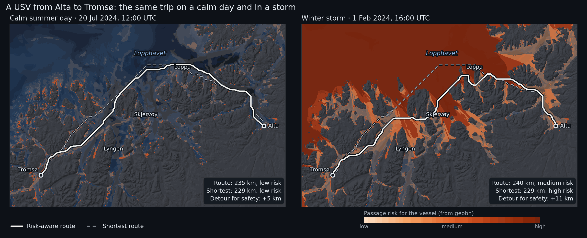

# Alta → Tromsø — Routing a USV in Calm Weather and Storm

**Location:** Troms and Finnmark, northern Norway (69.45°N–70.65°N, 18.4°E–23.6°E)

A small unmanned surface vessel (USV), 5–10 m long, has to sail from Alta to
Tromsø. The trip goes out Altafjorden, past the islands of Stjernøya and Loppa, across
Lopphavet (about 70 km of open sea on the border between Troms and Finnmark), past Skjervøy
and the mouth of Lyngen, and on to Tromsø. Much like a car's satnav routes around traffic
jams, the boat's planner routes around shallow rocks, busy shipping lanes and big waves.

geobn provides the map the planner uses. It combines the sea depth, ship traffic and the
weather into a probability of trouble for every 250 m pixel of the coast. The example plans
the same trip for two real days:

- **A calm summer day** (20 July 2024). The boat takes nearly the shortest way, along the
  outer side of the islands.
- **A winter storm** (Ingunn, 1 February 2024), with 9 m waves and 23 m/s wind from the
  west-northwest in Lopphavet. The open sea is the riskiest part of the map. The boat shelters
  behind Loppa, crosses the open water where it is narrow, and follows the sounds after
  Skjervøy. The route is longer but has less risk.



The dashed line is the shortest route; the solid line is the route that balances distance
against risk. The colour is geobn's passage risk: the expected value of `usv_risk` on a scale
where low is 0, medium 0.5 and high 1.

## What it demonstrates

- The chain from data to decision: data sources → Bayesian network → risk map → route
- Reading MET Norway's model archives (wave, ocean and weather models) through a small
  custom `DataSource` in the example, with the same disk cache as the built-in sources
- `MosaicSource` with a fallback for every archive layer, and a provenance report saying which
  source supplied each layer
- `DerivedSource` for elevation → depth, kelvin → °C and a wave estimate for sheltered water
- `freeze()` for the static layers and `precompute()`, so each new weather situation costs a
  table lookup
- Route planning *outside* the library, from the posterior of the risk node
- The precomputed table used outside Python: an interactive map runs the model in the browser
  while you set the weather with sliders

## Bayesian network structure

```
water_depth ─┬────────────────────────► grounding_risk ──┐
wave_height ─┤ (breaking waves in shallows)               │
             ├──────────────► sea_state_risk ─────────────┼──► usv_risk
current_speed┘                                            │
vessel_traffic ───────────────► collision_risk ───────────┤
air_temperature ─┬────────────► icing_risk ───────────────┘
wind_speed ──────┘
```

Six inputs, four risk mechanisms and one query node, `usv_risk` with states
`{low, medium, high}`. The probabilities in `usv_passage.bif` are expert judgement for a
vessel of this size, with the reasoning written as a comment above each table:

- **Grounding** is likely in water under 5 m in any weather. In 5–20 m of water it depends on
  the waves: rough and severe seas break over shoals. This keeps the inner leads from being
  free in a storm, so the planner has a real trade-off between exposed and shallow water.
- **Sea state** becomes a problem above about 2.5 m significant wave height and dangerous
  above 4.5 m. Strong currents make each state worse.
- **Collision** grows with ship traffic density.
- **Icing** from freezing spray needs air below about −2 °C and wind above about 10 m/s.
- **`usv_risk`** is driven by the worst mechanism, with the others adding a little.

## Data sources

| Node | Source | Details |
|------|--------|---------|
| `water_depth` | `DerivedSource` over `WCSSource` (EMODnet Bathymetry) | ~115 m; land becomes NaN, so no route can cross it |
| `vessel_traffic` | `WCSSource` (EMODnet Human Activities) | vessel density, all ship types, 2023, hours per km² per month, ~1 km |
| `wave_height` | WW3 4 km wave model archive (MET Norway), scaled by exposure | see [Waves in sheltered water](#4-waves-in-sheltered-water) |
| `current_speed` | NorKyst v3 800 m ocean model archive (MET Norway) | surface current speed from the east and north components |
| `wind_speed` | MEPS 2.5 km weather model archive (MET Norway) | 10 m wind speed |
| `air_temperature` | MEPS 2.5 km weather model archive (MET Norway) | 2 m temperature |

All sources are free and need no API key. EMODnet data and MET Norway data are published
under CC BY 4.0.

## Annotated walkthrough

### 1. A projected grid

```python
CRS        = "EPSG:32634"                              # UTM zone 34N
RESOLUTION = 250.0                                     # metres
EXTENT     = (398_000, 7_704_500, 602_000, 7_840_500)  # 816 × 544 pixels

bn = geobn.load("usv_passage.bif")
bn.set_grid(CRS, RESOLUTION, EXTENT)
```

A projected CRS keeps pixel sizes, and therefore route lengths, in metres.

### 2. Static layers

```python
elevation = geobn.WCSSource(
    url="https://ows.emodnet-bathymetry.eu/wcs", layer="emodnet:mean", version="2.0.1",
    valid_range=(-1000.0, 3000.0), cache_dir=CACHE_DIR,
)
bn.set_input("water_depth", geobn.DerivedSource(depth_below_surface, elevation))

vessel_traffic = geobn.WCSSource(
    url="https://ows.emodnet-humanactivities.eu/wcs",
    layer="emodnet__vesseldensity_allavg",
    extra_subsets=['time("2023-01-01T00:00:00.000Z")'],
    cache_dir=CACHE_DIR,
)
bn.set_input("vessel_traffic", geobn.MosaicSource(
    [vessel_traffic, geobn.ConstantSource(0.0)], names=["EMODnet", "none recorded"],
))
```

The EMODnet vessel density coverage has a time axis with one value per year, which
`extra_subsets` selects.

### 3. Weather from the MET Norway archives

MET Norway's model archives on [thredds.met.no](https://thredds.met.no) are NetCDF files on
projected model grids: rotated pole for WW3, Lambert conformal for MEPS and polar
stereographic for NorKyst. `met_archive.py` defines `MetArchiveSource`, a `DataSource` that
asks OPeNDAP for the block of the model grid covering the study area, reads the plain-text
response with numpy and returns it on the model's own projection. geobn then reprojects it
like any other raster. The source implements `_fetch` and `_cache_key` (see
[Data Sources](../api/sources/index.md)), so `cache_dir` works as it does for the built-in
sources.

```python
wind_speed = geobn.MosaicSource(
    [MetArchiveSource(meps_file(t), ("x_wind_10m", "y_wind_10m"), t,
                      combine=np.hypot, name="wind_speed", cache_dir=CACHE_DIR),
     geobn.ConstantSource(sc.wind_speed)],
    names=["MEPS", "scenario constant"], on_error="skip",
)
```

Every weather layer is a mosaic that ends in a constant for the scenario. With
`on_error="skip"`, an unreachable archive gives a `UserWarning` and the constant takes over.
The run prints which source supplied each layer:

```
── Winter storm: 01 Feb 2024 16:00 UTC ──────────────────────
    offshore waves  : WW3 4 km 100%
    current_speed   : NorKyst 800 m 89%, NorKyst 800 m (nearest cell) 9%, assumed 0.2 m/s 3%
    wind_speed      : MEPS 100%
    wind direction  : MEPS 100%
    air_temperature : MEPS 100%
```

Current speed is read twice from the same cache entry. Bilinear resampling leaves a gap along
the coast wherever a model cell has a land neighbour, and the second read, with
`resampling="nearest"`, fills most of it.

### 4. Waves in sheltered water

WW3 describes the open sea well, but its 4 km cells do not resolve the sounds: a cell either
has no value there or covers water and islands alike. `waves.py` brings the offshore sea
state onto the 250 m grid according to how exposed each pixel is:

1. WW3 is extended into the gaps with the nearest model value and smoothed, which gives the
   offshore wave height next to every pixel.
2. The *effective fetch* of each pixel is measured by casting rays upwind, at the wind
   direction and ±12°, ±24° and ±36°, until they reach land.
3. The offshore wave height is scaled by `sqrt(fetch / 50 km)`, capped at 1, because
   fetch-limited waves grow with the square root of the fetch. Open water with 50 km of fetch
   or more keeps the WW3 value.
4. Where a long sound raises more wind sea of its own than that, the JONSWAP fetch-limited
   height is used instead.

```python
offshore_hs = geobn.MosaicSource(
    [geobn.DerivedSource(spread_offshore, MetArchiveSource(ww3_file(t), "hs", t, ...)),
     geobn.ConstantSource(sc.hs_offshore)],
    names=["WW3 4 km", "scenario constant"], on_error="skip",
)
wave_height = geobn.DerivedSource(
    wave_height_250m, offshore_hs, elevation, wind_speed, wind_from
)
```

This is an approximation. It ignores refraction, diffraction around headlands and
wave–current interaction, so its values are estimates of exposure. It makes the wave field
vary in space, which the planner needs: with the same wave height everywhere, a storm would
raise the risk of every route alike and leave the choice of route unchanged.

### 5. Freeze, precompute, infer

```python
for node, bp in BREAKPOINTS.items():
    bn.set_discretization(node, bp)
bn.freeze("water_depth", "vessel_traffic")
bn.precompute(query=["usv_risk"])       # 4·4·3·3·3·3 = 1,296 combinations

for sc in SCENARIOS:
    for node, src in weather_sources(sc, sc.time, elevation)[0].items():
        bn.set_input(node, src)
    result = bn.infer(query=["usv_risk"])
    risk = result.expected_value("usv_risk", {"low": 0.0, "medium": 0.5, "high": 1.0})
```

Only the weather inputs change between scenarios. The frozen layers are fetched and
discretised once, and every `infer()` is a lookup in the precomputed table.

### 6. From risk map to route

Route planning is not part of geobn. `routing.py` builds a graph with one node per water
pixel, joined to its eight neighbours, and runs Dijkstra's algorithm from
`scipy.sparse.csgraph`. A step costs its length times

```
1 + K_RISK · risk          (K_RISK = 8)
```

so a kilometre of certain high risk costs as much as 9 km of risk-free water. With
`K_RISK = 0` the planner returns the shortest route. Land and pixels without data have no
edges, so no route can cross them.

```python
cost = np.where(water, 1.0 + K_RISK * risk, np.nan)
path, length_m, _ = plan_route(cost, start, goal, pixel_size=250.0)
```

### 7. The interactive map

`output/alta_tromso_map.html` is a Leaflet map with sliders for the offshore wave height, the
wind speed, the wind direction and the air temperature, starting at Ingunn's values. Moving a
slider recomputes the passage risk of every pixel and plans the risk-aware route again; the
shortest route stays where it is. Dragging a slider shows how the
route leaves the open water as the waves build, and how the sheltered side moves when the wind
turns.

The browser runs the same model as the script, without Python or pgmpy. `webmap.py` exports:

- geobn's precomputed table, as the expected `usv_risk` and P(high) for each of the 1,296
  combinations of input states, read with `bn.query_batch()`;
- the states of the inputs that the sliders do not change: water depth, ship traffic and
  surface current (the calm-day NorKyst field);
- the effective fetch of every pixel for 16 wind directions, from which the page computes the
  wave height with the formula in `waves.py`;
- the breakpoints, the route cost and the start and goal.

`webmap.js` discretises the slider values and the wave heights with the same breakpoints,
looks up the risk, and runs Dijkstra's algorithm on the same graph as `routing.py`. The wind,
the temperature and the offshore wave height apply to the whole area, and the offshore wave
height is then reduced in sheltered water, which is the calculation the script falls back to
when the weather archives cannot be reached. With the same inputs, the page and the Python
code give the same risk map and the same route.

[Open the interactive map](alta_tromso_map.html). The page is a single file of about 2.5 MB. The base maps are Kartverket's greyscale and
topographic maps, its nautical chart and OpenStreetMap; the risk layer is reprojected to Web
Mercator so it lines up with them.

## Scenario dates

The dates come from a scan of the WW3 archive at a point in Lopphavet (70.40°N, 21.0°E),
every three days from October 2023 to March 2026, winters and summers.

| Scenario | Time (UTC) | In Lopphavet | Why |
|---|---|---|---|
| Calm | 20 July 2024, 12:00 | Hs 0.25 m, wind 1.4 m/s | the calmest summer midday of 2024 in the archive |
| Storm | 1 February 2024, 16:00 | Hs 9 m, wind 23 m/s from WNW | extreme weather *Ingunn*, [MET info 25/2024](https://www.met.no/vaer-og-klima/ekstremvaervarsler-og-andre-farevarsler/ekstremvaer-far-navn/_/attachment/inline/968d86dd-82b8-4fe5-b0b7-451f9b88f7ce:9d41c437c62b0cd4e8eea389fd82f42ce4b1ccb6/MET-info-25-2024.pdf) |

Ingunn is a named extreme-weather low, not a polar low. The scan found higher waves on
29 January 2024, with wind from the west-southwest. Ingunn was chosen because it is documented
by MET Norway and because its wind blew from the direction Lopphavet is most open to.

## Key outputs

- **`output/scenarios.png`**: the two scenarios side by side
- **`output/readme_animation.gif`**: the route as the weather worsens, from 0.5 m to 8 m
  offshore waves with the wind from the northwest (the README image)
- **`output/alta_tromso_map.html`**: the interactive map with weather sliders, described in
  [section 7](#7-the-interactive-map)
- **`output/storm_timelapse.gif`**: Ingunn arriving hour by hour on 1 February, with the route
  planned again for every hour
- **`output/<scenario>/usv_risk.tif`**: P(low), P(medium), P(high) and entropy;
  **`risk_score.tif`**: the expected risk used by the planner
- **`output/routes_<scenario>.geojson`**: the shortest and risk-aware routes, with length,
  mean risk and the largest P(high) along each

The run ends with a summary:

```
  scenario route                  length  mean risk  max P(high)
  calm     shortest               229 km       0.18         0.35
  calm     risk_aware             235 km       0.13         0.35
  storm    shortest               229 km       0.59         0.91
  storm    risk_aware             240 km       0.42         0.91
```

The storm route still reaches a P(high) of 0.91 where it crosses the open water south of
Loppa. Every route between the two harbours crosses some open water.

## Limitations

- The probabilities in the network are expert judgement, not fitted to incidents.
- The narrowest water on either route is about 5 pixels (1.3 km) wide. Sounds narrower than
  two pixels (500 m) cannot be resolved at this resolution, and the harbours themselves are
  one or two pixels wide; the start and goal are moved to the nearest water pixel.
- EMODnet depths at 115 m, resampled to 250 m, do not show individual rocks. The
  `very_shallow` state stands in for them.
- Current speed is the surface current of an 800 m model; tidal streams in narrow sounds are
  stronger than it shows.

## How to run

```bash
uv run python examples/alta_tromso/run_example.py
```

The first run downloads the bathymetry, the vessel density and about 200 small OPeNDAP
subsets from thredds.met.no, which takes about five minutes; most of it is for the hourly
timelapse.
Everything is cached in `examples/alta_tromso/cache/`, and later runs make no requests.
Add `--no-timelapse` to skip the GIF.
